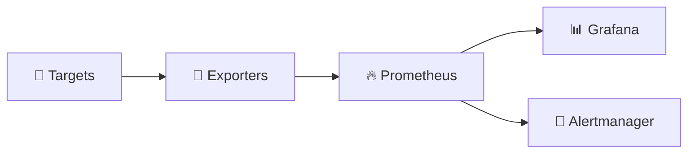
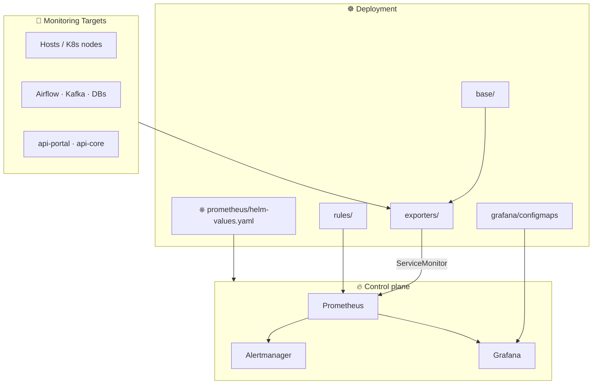
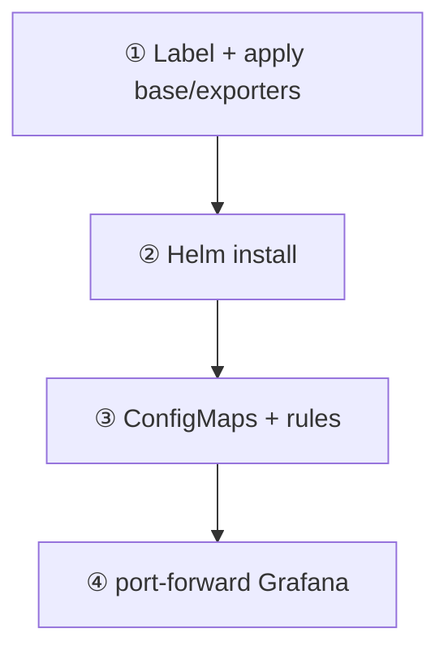

# 📊 Enterprise Observability Stack

[](https://prometheus.io/) [](https://grafana.com/) [](https://kubernetes.io/) [](https://helm.sh/) [](https://www.docker.com/) [](https://prometheus.io/docs/alerting/latest/alertmanager/) [](https://opensource.org/licenses/MIT) [](https://github.com/codingnanyong/observability/releases)

**Kubernetes-first** observability: scrape hosts & platforms with Prometheus, visualize with Grafana **Morning** dashboards, deploy the control plane with **Helm** (`kube-prometheus-stack`) and in-cluster exporters / ServiceMonitors.



## 🏗️ Architecture



| Layer | What it does |
|-------|----------------|
| 🎯 Targets | Hosts, Airflow / Kafka / DBs, APIs |
| 📡 Exporters | DaemonSets / Deployments + ServiceMonitors |
| ⎈ Helm | `kube-prometheus-stack` via `prometheus/helm-values.yaml` |
| ☀️ Grafana | Morning L1–L3 hierarchy (ConfigMap sidecar) |

## 📁 Project structure

```text
observability/
├── base/                 # 🔭 Namespace, NetworkPolicy, node labeling
├── exporters/            # 📡 K8s exporters + ServiceMonitors
├── grafana/
│   ├── configmaps/       # ☀️ Morning dashboard ConfigMaps
│   ├── dashboards/       # 📈 JSON sources
│   └── scripts/morning/  # 🐍 Dashboard generator
├── prometheus/
│   └── helm-values.yaml  # ⎈ kube-prometheus-stack values (only)
├── rules/                # 📐 Recording rules
└── docs/                 # 📚 Docs (= Wiki source)
```

## ✨ Key features

| | |
|---|---|
| ☸️ **Kubernetes + Helm** | Control plane via `kube-prometheus-stack` |
| 📡 **In-cluster exporters** | node, cAdvisor, Kafka, Postgres, API, Airflow |
| ☀️ **Morning dashboards** | Hierarchical Grafana views + ConfigMap sidecar |
| 🔒 **Secure by default** | ClusterIP, templated secrets, no committed inventory IPs |

## 🚀 Quick start



```bash
# 1) Label nodes and apply base + exporters
kubectl label node <node-name> observability=true --overwrite
kubectl apply -f base/
kubectl apply -f exporters/

# 2) Install / upgrade kube-prometheus-stack
helm repo add prometheus-community https://prometheus-community.github.io/helm-charts
helm upgrade --install kube-prometheus-stack prometheus-community/kube-prometheus-stack \
  -n observability --create-namespace \
  -f prometheus/helm-values.yaml

# 3) Dashboards + recording rules
kubectl apply -f grafana/configmaps/
kubectl apply -f rules/

# 4) Access Grafana (ClusterIP)
kubectl -n observability port-forward svc/kube-prometheus-stack-grafana 3000:80
# → http://127.0.0.1:3000/d/morning-overview
```

<details>
<summary>🔧 Optional: Morning site overrides</summary>

```bash
cp grafana/scripts/morning/site_local.example.py grafana/scripts/morning/site_local.py
python grafana/scripts/build_morning_hierarchy.py
kubectl apply -f grafana/configmaps/
```

Do **not** commit `site_local.py` — see [Security Hygiene](./docs/Security-Hygiene.md).

</details>

## 📚 Documentation

| | Resource |
|---|---------|
| 📖 | [Docs home](./docs/README.md) — getting started, architecture, security |
| ☀️ | [Grafana dashboards](./grafana/dashboards/README.md) — Morning hierarchy & rebuild |
| 🌐 | [Wiki](https://github.com/codingnanyong/observability/wiki) — same content as `docs/` |
| 🏷️ | [Releases](https://github.com/codingnanyong/observability/releases) |

## 🔒 Security

- Keep Prometheus / Grafana as **ClusterIP** — use port-forward, VPN, or authenticated Ingress
- Do not commit real IPs, `site_local.py`, or secret env files
- Prefer `sslmode=require` for Postgres exporter DSNs

## 📄 License

MIT — see [LICENSE](./LICENSE).
