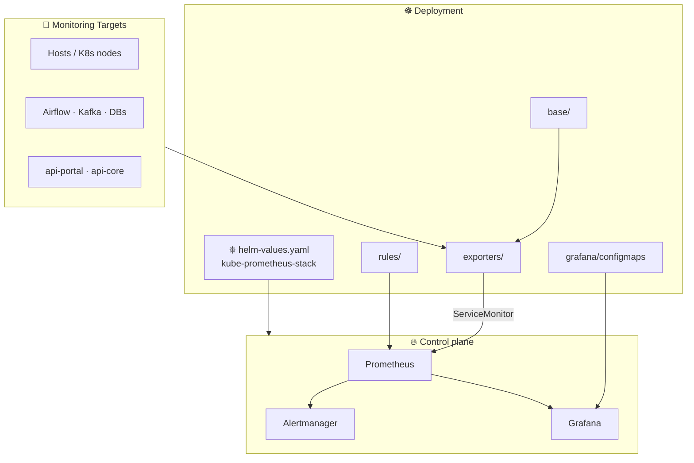
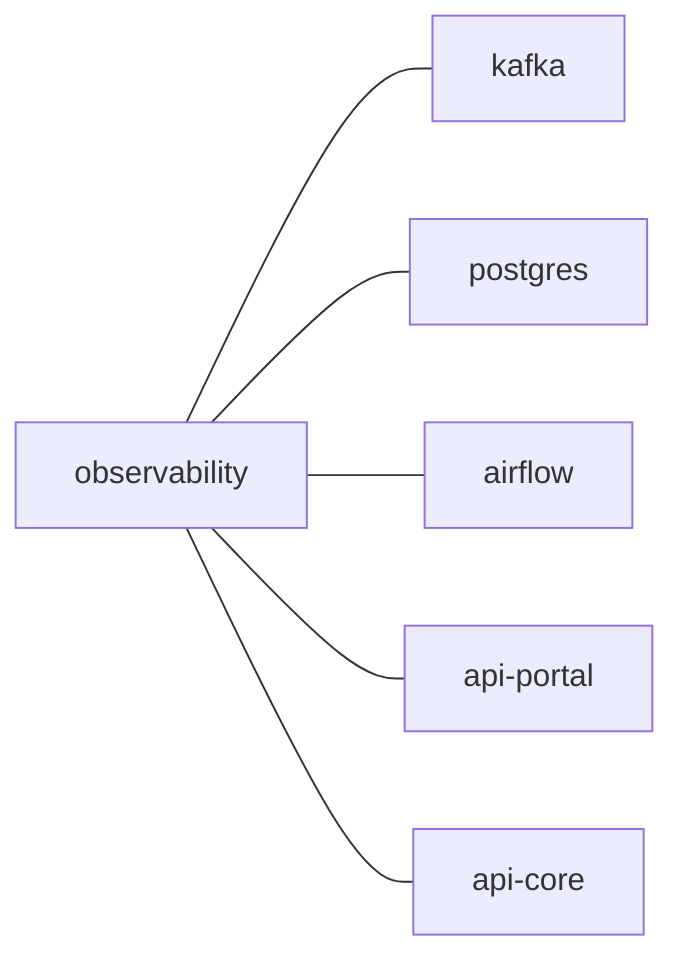

# 🏗️ Architecture

End-to-end flow from workloads to dashboards.

## 📦 Layers

| # | Layer | Role |
|---|--------|------|
| 1 | 🎯 **Targets** | Hosts, platforms (Airflow/DB/Kafka), APIs |
| 2 | 📡 **Exporters** | DaemonSets / Deployments + ServiceMonitors (`exporters/`) |
| 3 | 🔥 **Prometheus** | Helm chart via `prometheus/helm-values.yaml` |
| 4 | 📊 **Grafana** | Morning hierarchy via ConfigMap sidecar |

## 🗺️ Kubernetes layout (generic names)

| Area | Namespace / name |
|------|------------------|
| 🔭 Observability stack | `observability` |
| 📨 Kafka | `kafka` |
| 🗄️ Postgres | `postgres` |
| 🌬️ Airflow | `airflow` |
| 🌐 APIs | `api-portal`, `api-core` |

Host placeholders in dashboards: `worker-01`, `worker-02` (override via `site_local.py`).
