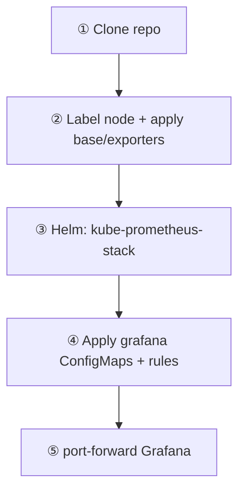

# 🚀 Getting Started

Bring up the stack in five steps: **label nodes → exporters → Helm → dashboards → port-forward**.



## ✅ Prerequisites

| Tool | Notes |
|------|--------|
| ☸️ Kubernetes + `kubectl` | Cluster access |
| ⎈ Helm 3 | Chart install/upgrade |
| 🐍 Python 3.12+ | Only if regenerating Morning dashboards |

## ① Clone

```bash
git clone https://github.com/codingnanyong/observability.git
cd observability
```

## ② Base + exporters

```bash
kubectl label node <node-name> observability=true --overwrite
kubectl apply -f base/
kubectl apply -f exporters/
```

## ③ kube-prometheus-stack (Helm)

Values live only in `prometheus/helm-values.yaml`.

```bash
helm repo add prometheus-community https://prometheus-community.github.io/helm-charts
helm repo update
helm upgrade --install kube-prometheus-stack prometheus-community/kube-prometheus-stack \
  -n observability --create-namespace \
  -f prometheus/helm-values.yaml
```

## ④ Dashboards + rules

```bash
kubectl apply -f grafana/configmaps/
kubectl apply -f rules/
```

## ⑤ Access Grafana

Services are **ClusterIP** — use port-forward (or Ingress):

```bash
kubectl -n observability port-forward svc/kube-prometheus-stack-grafana 3000:80
# http://127.0.0.1:3000/d/morning-overview
```

### 🔧 Optional site overrides

```bash
cp grafana/scripts/morning/site_local.example.py \
   grafana/scripts/morning/site_local.py
python grafana/scripts/build_morning_hierarchy.py
kubectl apply -f grafana/configmaps/
```

> 💡 Tip: never commit `site_local.py` or real host inventories — see [[Security-Hygiene]].
