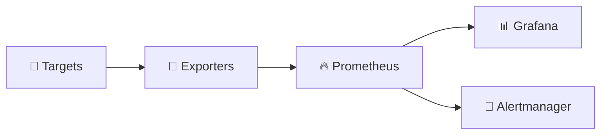

# 🏠 Enterprise Observability Stack

Welcome to the project wiki — a **Kubernetes + Helm** observability stack built around Prometheus and Grafana.

## 📚 Pages

| Page | What you'll find |
|------|------------------|
| [[Getting-Started]] | 🚀 Clone, Helm install, first apply |
| [[Architecture]] | 🏗️ Stack layers & data flow |
| [[Kubernetes-Exporters]] | 🧩 `base/` + `exporters/` manifests |
| [[Morning-Dashboards]] | ☀️ L1–L3 Grafana hierarchy |
| [[Security-Hygiene]] | 🔒 What stays out of git |
| [[Release-Notes]] | 🏷️ v1.1.0 summary |

## 🔗 Quick links

- [📦 Repository](https://github.com/codingnanyong/observability)
- [🏷️ Releases](https://github.com/codingnanyong/observability/releases)
- [🔐 Security policy](https://github.com/codingnanyong/observability/blob/main/SECURITY.md)
