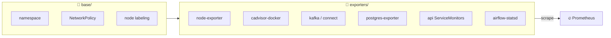

# 🧩 Kubernetes Exporters

Manifests live under `exporters/` and `base/`. Prometheus discovers them through **ServiceMonitors**.

## 📁 Base

| File | Purpose |
|------|---------|
| `base/namespace.yaml` | 🔭 `observability` namespace |
| `base/node-labeling.md` | 📌 Pin workloads with `observability=true` |
| `base/networkpolicy-metrics.yaml` | 🛡️ Limit metrics scrape (when CNI supports NP) |

## 📡 Exporters

| Path | Purpose |
|------|---------|
| `node-exporter` | 🖥️ Host OS metrics (`hostNetwork`, port 9101) |
| `cadvisor-docker` | 🐳 Non-K8s Docker metrics (read-only docker.sock) |
| `kafka-exporter` / `kafka-connect-exporter` | 📨 Kafka / Connect health |
| `postgres-exporter` | 🗄️ K8s Postgres (+ optional Docker Endpoints example) |
| `api/` | 🌐 ServiceMonitors for `api-portal` / `api-core` |
| `airflow-statsd` | 🌬️ Airflow statsd scrape |

## ⎈ Helm

Starter values: [`prometheus/helm-values.yaml`](https://github.com/codingnanyong/observability/blob/main/prometheus/helm-values.yaml)

- Prometheus / Grafana service type: **ClusterIP**
- Chart node-exporter disabled in favor of `exporters/node-exporter`
