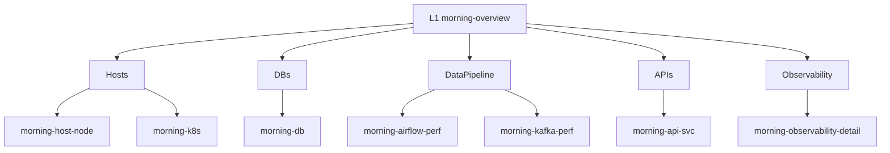

# ☀️ Morning Dashboards

Grafana folder: **Observability** (sidecar annotation `grafana_folder`).



## 🌳 Hierarchy

```text
L1 morning-overview
├─ 🖥️ Hosts → morning-hosts → morning-host-node / morning-k8s
├─ 🗄️ DBs → morning-dbs → morning-db
├─ 🔀 DataPipeline → airflow-perf / kafka-perf
├─ 🌐 APIs → morning-apis → morning-api-svc
└─ 🔭 Observability → observability-detail
```

## 🔄 Rebuild

```bash
python grafana/scripts/build_morning_hierarchy.py
kubectl apply -f grafana/configmaps/
```

| Piece | Path |
|-------|------|
| 🐍 Generator | `grafana/scripts/morning/` (`constants`, `panels`, `metrics`, `nav`, `io`, `builders/*`) |
| 📋 ConfigMaps | `grafana/configmaps/` |
| 📈 Recording rules | `rules/morning-host-occupancy.yaml` |

> 💡 Use `site_local.example.py` → `site_local.py` for host names (gitignored).
