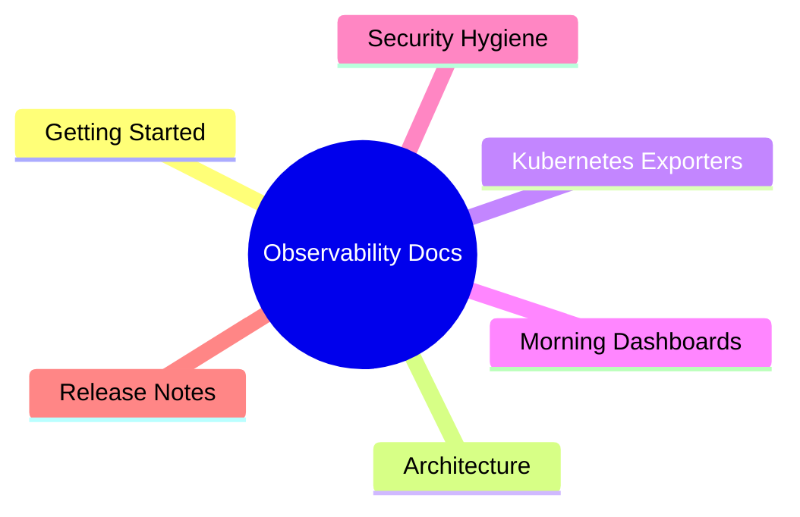

# 📚 Documentation

Versioned docs mirrored to the [GitHub Wiki](https://github.com/codingnanyong/observability/wiki).

| Page | Description |
|------|-------------|
| [🚀 Getting Started](Getting-Started.md) | Clone, Helm install, first apply |
| [🏗️ Architecture](Architecture.md) | Stack layers & Mermaid flow |
| [🧩 Kubernetes Exporters](Kubernetes-Exporters.md) | `base/` + `exporters/` |
| [☀️ Morning Dashboards](Morning-Dashboards.md) | Grafana hierarchy |
| [🔒 Security Hygiene](Security-Hygiene.md) | What stays out of git |
| [🏷️ Release Notes](Release-Notes.md) | v1.1.0 |

Wiki: https://github.com/codingnanyong/observability/wiki
