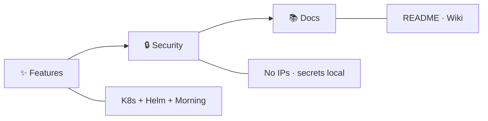

# 🏷️ Release Notes

## v1.1.0

Ops hardening for Morning dashboards and kube-prometheus-stack defaults.

### ✨ Features
- kube-state-metrics CPU/memory requests/limits (avoids BestEffort flaps that blanked `kube_*` series)
- Morning health rollups ignore deployment gaps when kube-state-metrics is down (`_sev_down_ksm`)
- Postgres occupancy excludes `airflow` / `openmetadata` datnames; Bad Pods uses waiting-reason filters
- Expanded Morning pipeline / Kafka / host occupancy dashboard panels

### 🔒 Security
- Helm defaults restored to **ClusterIP** (no NodePort on Grafana/Prometheus)
- Committed inventories stay generic (`worker-*`, `api-portal` / `api-core`); no RFC1918 API doc URLs

### 📚 Docs
- Grafana dashboard README: port-forward access; Wiki / Release Notes for v1.1.0

➡️ [GitHub Release v1.1.0](https://github.com/codingnanyong/observability/releases/tag/v1.1.0)

## v1.0.0

First tagged release (`develop` → `main` via #5).

### ✨ Features
- ☸️ K8s exporters / base, Morning Grafana hierarchy + generator, host occupancy rules

### 🔒 Security
- Inventory scrub → generic placeholders; secret/local overlays gitignored

### 📚 Docs
- README badges; Wiki + `docs/`

➡️ [GitHub Release v1.0.0](https://github.com/codingnanyong/observability/releases/tag/v1.0.0)
