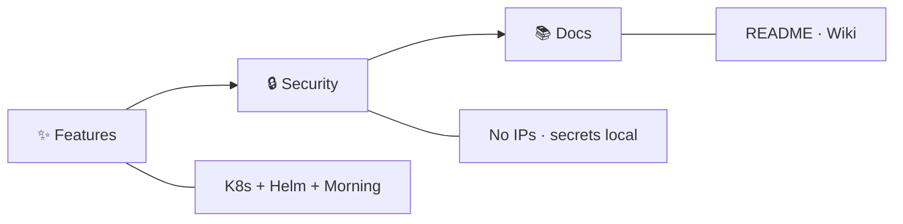

# 🏷️ Release Notes

## v1.0.0

First tagged release (`develop` → `main` via #5).

### ✨ Features
- ☸️ K8s exporters / base, Morning Grafana hierarchy + generator, host occupancy rules

### 🔒 Security
- Inventory scrub → generic placeholders; secret/local overlays gitignored

### 📚 Docs
- README badges; Wiki + `docs/`

➡️ [GitHub Release v1.0.0](https://github.com/codingnanyong/observability/releases/tag/v1.0.0)
