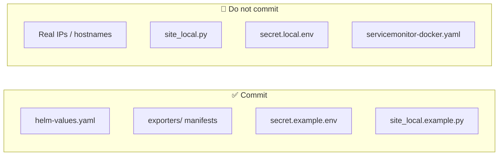

# 🔒 Security Hygiene

Keep inventories and secrets **out of git**. Templates stay in the repo; real values stay local.

## 🚫 Do not commit

- Real IPs / production hostnames
- `grafana/scripts/morning/site_local.py`
- `exporters/postgres-exporter/secret.local.env`
- `exporters/postgres-exporter/servicemonitor-docker.yaml` (copy from `.example`)

## ✅ Safe patterns

| Pattern | Detail |
|---------|--------|
| 📄 Templates | `secret.example.env`, `site_local.example.py` |
| 🔐 Postgres DSN | `sslmode=require`, password `CHANGE_ME` |
| 🌐 Exposure | ClusterIP + port-forward / authenticated Ingress (avoid NodePort on untrusted networks — Prometheus has no auth) |
| ⎈ Helm | `prometheus/helm-values.yaml` only (no file_sd inventories) |

## ⚠️ Residual ops risk

cAdvisor still needs elevated privileges + Docker socket for host Docker metrics — firewall host ports and pin to labeled nodes.
